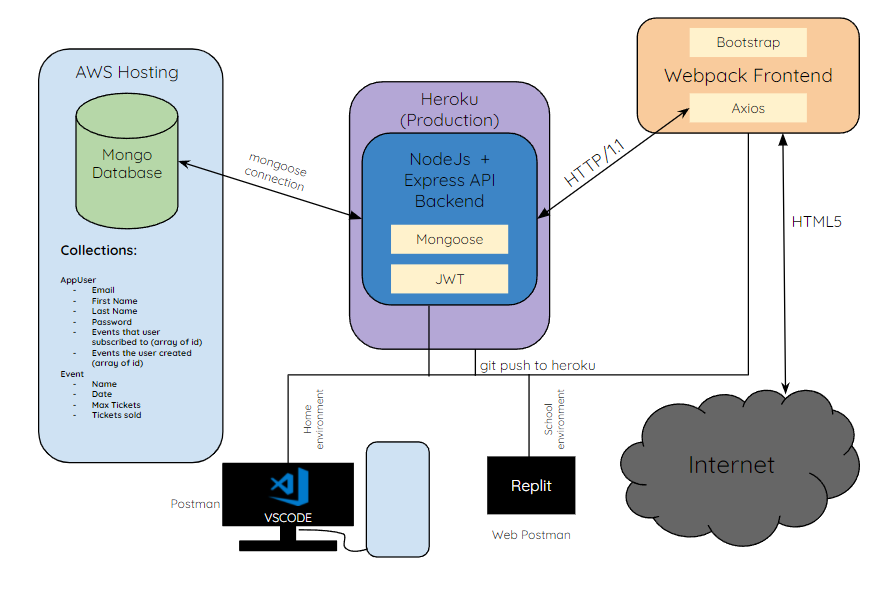

# Website design backend

## Database

The database is an AWS hosted mongoDB. The backend connects to the DB through mongoose. Chose mongoose for ease of use creating schemas and models. The database is storing AppUser and CuturalEvents Documents/Collections

## API

Using Node JS + Express. Authentication with JWT and mongoose to connect to the mongoDB. Creating schemas and models with mongoose and just using a controller with routing for ease of use. Using prettier to format all code.

# Layout

